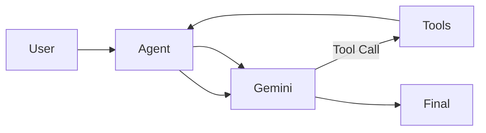

# AI Agent (Gemini Tool-Calling CLI)

A Python-based AI agent that uses **Google Gemini** to reason about tasks, call local tools, and iteratively arrive at a final answer — all from a clean command-line interface.

This project demonstrates **agentic AI architecture**, not just prompt engineering.

---

## 🔍 What This Demonstrates

- Practical use of LLM tool calling
- Controlled **reason → act → observe** agent loop
- Safe execution of local tools
- Deterministic, inspectable AI behavior
- Clean separation between model reasoning and system actions

---

## 🧠 How It Works (High Level)

1. User provides a prompt via CLI  
2. Gemini decides whether a tool is needed  
3. The agent executes approved local tools  
4. Tool results are fed back to the model  
5. The loop continues until a final answer is produced  

🛠️ Key Features

- Gemini 2.5 Flash integration
- Explicit tool schemas (no arbitrary code execution)
- Iteration limits to prevent infinite loops
- Sandboxed file and Python execution
- Unit-tested tool layer
- CLI-first design for transparency

📁 Project Structure

- main.py        # Agent loop + CLI entry point  
- functions/     # LLM-callable tools
- prompts.py     # System instructions
- config.py      # Shared configuration
- tests/         # Tool tests

▶️ Example Usage

- Run a question through the agent:
- uv run main.py "what files are in the pkg directory?"
- Verbose mode:
- uv run main.py "run the tests" --verbose

🔐 Safety & Design Principles

- No shell access
- Directory sandboxing
- Explicit allow-listed tools only
- Structured inputs and outputs
- Model is never trusted to execute code directly

🎯 Why This Matters

    -This project shows how to move from LLM demos to production-style AI systems that are:
        -Safer
        -More predictable
        -Easier to test and maintain
    -It reflects real-world concerns in applied AI engineering: observability, control, and security.

## Strategic & Security Considerations

This project demonstrates a transition from basic scripting to a production-ready backend architecture for AI-driven applications. From a strategic advisory perspective, the following security and architectural principles were prioritized:

RESTful API Security: Developed using FastAPI, focusing on the principle of least privilege in data exchange. By implementing structured Pydantic schemas, the system ensures strict input validation to prevent common injection attacks.

Architectural Modularity: The codebase is decoupled to support Dockerization, allowing for secure, isolated deployment in containerized environments. This is a critical requirement for maintaining "Cloud-Ready" status in modern government ICT infrastructure.

Resource Management & Rate Limiting: Designed with backend efficiency in mind to mitigate potential "Denial of Wallet" or Resource Exhaustion attacks common in LLM-integrated systems.

Traceability & Logging: Structured to support comprehensive audit trails—a necessity for ITSG-33 compliance—ensuring that system interactions can be monitored and verified in high-security environments.

📜 License

MIT

## 🤝 Contributing

This project was developed as part of a guided curriculum from **Boot.dev**.

While the overall structure and learning objectives were provided, the implementation, extensions, testing, and refinements reflect my own work and understanding. The project has been adapted and expanded beyond the base exercises to demonstrate practical, production-style AI agent architecture.
